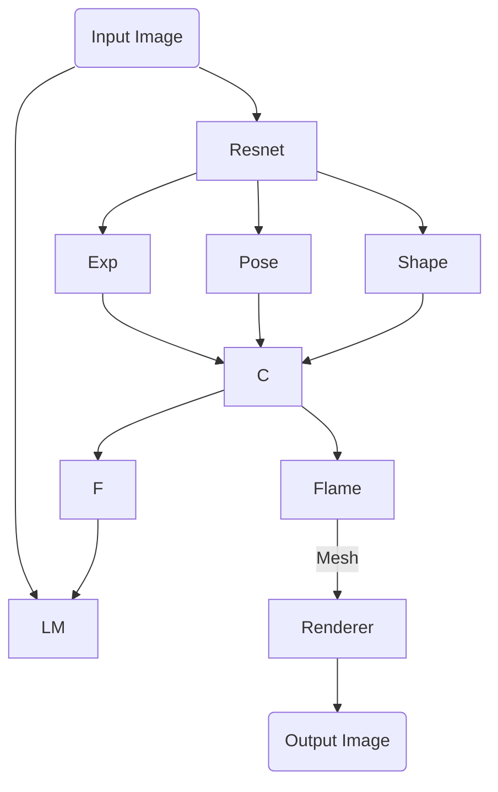

# Architecture

```mermaid
  graph TD;
      I(Input Image)
      Im(Output Image)

      I --> Resnet;
      Resnet --> Shape;
      Resnet --> Pose;
      Resnet --> Exp;

      Shape --> C;
      Pose --> C;
      Exp --> C;

      C --> F;
      F --> LM;
      I --> LM;

      C --> Flame;
      Flame --  Mesh --> Renderer;
      Renderer --> Im;
```
# Files

# Data

